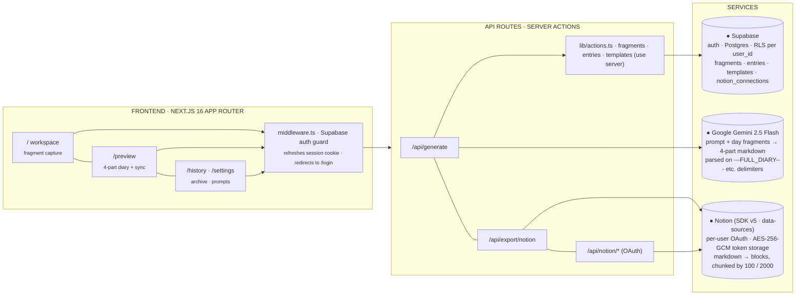

<div align="right">

[中文](./README.md)&nbsp;·&nbsp;[**English**](./README.en.md)

</div>

<div align="center">

<br>

<sub>· An external brain for your day ·</sub>

# Diarybuddy<span>.</span>

Jot fragments all day long — a quick thought, a lecture note, a line on the train.
At night, one tap turns the pile into a four-part diary, and another tap syncs it
straight into your Notion workspace.

<br>

[](https://diarybuddy.vercel.app)
[](https://nextjs.org)
[](https://react.dev)
[](https://tailwindcss.com)
[](https://ai.google.dev)
[](https://vercel.com)
[](#license)

</div>

<br>

---

Most journaling apps ask you to *sit down and write*. That's the bottleneck. Diarybuddy flips the loop: drop raw fragments into a chat-like surface throughout the day, and Gemini restructures them into **a full diary, a key-points summary, a mentor's reflection, and a to-do list** — stored in Supabase, exportable as Markdown, and one-click pushable to your own Notion database.

> "Your AI external brain — capture anything, let the model do the sediment."
> &nbsp;&nbsp;&nbsp;&nbsp;— Diarybuddy, product north star

<table>
<tr>
<td align="center"><b>4</b><br><sub>SECTIONS PER ENTRY</sub></td>
<td align="center"><b>1-click</b><br><sub>NOTION SYNC</sub></td>
<td align="center"><b>per-user</b><br><sub>OAUTH + RLS</sub></td>
<td align="center"><b>.md</b><br><sub>BULK EXPORT</sub></td>
</tr>
</table>

---

## § Contents

<table>
<tr>
<td><code>01</code> <a href="#01-features">Features</a></td>
<td><code>06</code> <a href="#06-getting-started">Getting started</a></td>
</tr>
<tr>
<td><code>02</code> <a href="#02-how-it-works">How it works</a></td>
<td><code>07</code> <a href="#07-project-structure">Project structure</a></td>
</tr>
<tr>
<td><code>03</code> <a href="#03-the-four-part-output">The four-part output</a></td>
<td><code>08</code> <a href="#08-configuration">Configuration</a></td>
</tr>
<tr>
<td><code>04</code> <a href="#04-tech-stack">Tech stack</a></td>
<td><code>09</code> <a href="#09-roadmap">Roadmap</a></td>
</tr>
<tr>
<td><code>05</code> <a href="#05-architecture">Architecture</a></td>
<td><code>10</code> <a href="#10-faq--credits">FAQ &amp; credits</a></td>
</tr>
</table>

---

## 01 Features

Everything orbits one loop: `capture → generate → sync`.

| | | |
|---|---|---|
| **✎ Fragment capture** <br><sub>`F.01`</sub> | **✦ One-tap generate** <br><sub>`F.02`</sub> | **§ Four-part output** <br><sub>`F.03`</sub> |
| A chat-like workspace where every line is timestamped and written straight to Supabase. A session-date lock keeps midnight from silently flipping the day while you're still writing. | "Generate" sends the day's fragments to `gemini-2.5-flash` with your editable system prompt. The result is upserted on `session_date`, so regenerating just replaces. | Full diary · key points · mentor insights · action items. The model emits four delimiter-separated sections; the route parses them into discrete DB columns for clean rendering and export. |
| **N Notion sync** <br><sub>`F.04`</sub> | **▤ History & highlights** <br><sub>`F.05`</sub> | **⌘ Prompt templates** <br><sub>`F.06`</sub> |
| Per-user OAuth (Notion SDK v5, data-sources model). AES-256-GCM-encrypt the access token, pick a target database in Settings, one tap on any entry creates a richly-typed page. | Calendar-style list of every day you've written. Star entries, jump back to edit raw fragments, regenerate with a newer prompt. | Edit the system prompt directly from Settings. The oldest template is injected into every generation — swap it to change the diary's voice without touching code. |
| **↓ Bulk Markdown export** <br><sub>`F.07`</sub> | **⏻ Privacy by default** <br><sub>`F.08`</sub> | |
| One button in Settings downloads every entry as a single `.md` file (four sections each, separator fences), ideal for cold-storage backup or piping into Obsidian. | Supabase row-level security on every table; Notion tokens AES-GCM encrypted at rest; OAuth `state` HMAC-signed with a 10-minute TTL. Rotating the key invalidates every stored token. | |

---

## 02 How it works

1. **Open the workspace** — session date is seeded from local time and locked in `sessionStorage` for the tab's lifetime.
2. **Drop fragments** all day. Each one hits `addFragment` (server action) and lands in `diary_fragments` under your `user_id`.
3. **Tap Generate**. `POST /api/generate {date}` re-checks auth, pulls fragments, injects your first template's prompt, calls Gemini.
4. **The response is parsed** on the four literal markers (`---FULL_DIARY---`, `---KEY_POINTS---`, `---MENTOR_INSIGHTS---`, `---ACTION_ITEMS---`) and upserted into `diary_entries`.
5. **Review on `/preview`** — four sections rendered as Markdown with a "Sync to Notion" button.
6. **Export** — bulk `.md` download from Settings, or push one entry at a time to Notion via `POST /api/export/notion`.

---

## 03 The four-part output

Gemini is asked to emit four sections with literal delimiters between them. The route parses those slices into separate DB columns — if you change the prompt's heading or delimiter format, `parseResponse` in `/api/generate/route.ts` has to change in lockstep.

| Part | Heading | Stored in |
|---|---|---|
| `I.` | **📝 Full diary** <br><sub># level-1 heading with date + title</sub> | `diary_entries.full_diary` — title extracted into `title` |
| `II.` | **✨ Key points** <br><sub>5–7 numbered one-liners</sub> | `diary_entries.key_points` |
| `III.` | **🧠 Mentor insights** <br><sub>2–3 observations + 2–3 suggestions</sub> | `diary_entries.mentor_insights` |
| `IV.` | **✅ Action items** <br><sub>first-person checkbox list, grouped by domain</sub> | `diary_entries.action_items` |

> **product voice** &nbsp;·&nbsp; The default system prompt and seeded templates are written in Chinese; the generated diaries are Chinese Markdown with emoji headings. That's the product's voice — don't "translate" it casually.

---

## 04 Tech stack

| Layer | Choice | Why |
|---|---|---|
| Framework | `Next.js 16` (App Router) | Server actions + API routes in one surface, Vercel-native. |
| Runtime | `React 19` + `TypeScript 5` | Server Components, async Suspense boundaries for the workspace. |
| UI | `Tailwind v4` + `lucide-react` | Warm-paper palette hand-rolled as utility classes — no design-system lock-in. |
| Auth & DB | `Supabase` (Postgres + Auth) | Row-level security on every table; `user_id` defaults to `auth.uid()`. |
| LLM | `@google/generative-ai` · gemini-2.5-flash | Fast, cheap, big context — enough for a full day of fragments in one call. |
| Notion | `@notionhq/client` v5 | Data-sources model (not legacy database IDs). AES-256-GCM-encrypted tokens. |
| Crypto | Node `crypto` | AES-GCM for Notion tokens, HMAC-signed OAuth `state` (10-min TTL), one shared `NOTION_TOKEN_ENCRYPTION_KEY`. |
| Deploy | `Vercel` (auto) | Push to `main` → production in ~90s. Env vars live in Project Settings. |

---

## 05 Architecture



---

## 06 Getting started

> **workflow** &nbsp;·&nbsp; This project is **cloud-first**. Normal changes: edit → push to `main` → Vercel auto-deploys to [diarybuddy.vercel.app](https://diarybuddy.vercel.app) in ~90s. Env vars live in Vercel Project Settings. Local `npm run dev` is only for offline debugging.

### Prerequisites

- Node `>= 20`, npm (project uses plain `npm`, no lockfile-manager tricks)
- A Supabase project with `supabase-schema.sql` executed
- A Gemini API key
- (optional) A Notion *Public* integration with redirect URI registered

### Local setup

```bash
# clone
git clone https://github.com/turtojian520/diarybuddy.git
cd diarybuddy   # package.json is at the root

# install
npm install

# env — point at a non-production Supabase/Notion so you don't pollute prod
cp .env.local.example .env.local
# fill in SUPABASE_URL / ANON_KEY / GEMINI_API_KEY / NOTION_*

# run schema in Supabase SQL Editor:
#   supabase-schema.sql

npm run dev    # → http://localhost:3000
npm run build  # type + lint check (no test framework)
```

---

## 07 Project structure

```text
diarybuddy/                       # repo root — package.json lives here
├── src/
│   ├── middleware.ts             # Supabase auth guard (redirects unauth → /login)
│   ├── app/
│   │   ├── page.tsx              # workspace — fragment capture + Generate
│   │   ├── preview/page.tsx      # 4-section view + Sync-to-Notion
│   │   ├── history/page.tsx      # archive / highlights
│   │   ├── settings/page.tsx     # prompt template + Notion connect + bulk export
│   │   ├── login/ · auth/callback/   # Supabase Auth
│   │   └── api/
│   │       ├── generate/         # POST — Gemini call + delimiter parse + upsert
│   │       ├── export/notion/    # POST {date} — build blocks, create Notion page
│   │       └── notion/           # oauth · databases · select-database · status · disconnect
│   ├── components/
│   │   └── TopNav.tsx
│   └── lib/
│       ├── actions.ts            # 'use server' — CRUD + DEFAULT_TEMPLATES
│       ├── crypto.ts             # AES-256-GCM + HMAC-signed OAuth state
│       ├── utils.ts              # getTodayDate, formatDateDisplay
│       ├── supabase.ts           # browser client + row types
│       ├── supabase/             # browser · server · middleware clients
│       └── notion/               # client · markdown-to-blocks
├── supabase-schema.sql           # run in SQL Editor on schema changes
├── CLAUDE.md / AGENTS.md         # contributor notes
└── .env.local.example
```

---

## 08 Configuration

### Environment variables

<sub>Configured in Vercel Project Settings for production. `.env*` files are in `.gitignore`.</sub>

| Key | Required | Purpose |
|---|---|---|
| `NEXT_PUBLIC_SUPABASE_URL` | yes | Supabase project URL. |
| `NEXT_PUBLIC_SUPABASE_ANON_KEY` | yes | Public anon key — RLS is on everywhere. |
| `GEMINI_API_KEY` | yes | Model key for `gemini-2.5-flash`. |
| `NOTION_OAUTH_CLIENT_ID` | yes | Public integration client ID. |
| `NOTION_OAUTH_CLIENT_SECRET` | yes | Public integration client secret. |
| `NOTION_OAUTH_REDIRECT_URI` | yes | Must exactly match the URI registered on the Notion integration. |
| `NOTION_TOKEN_ENCRYPTION_KEY` | yes | 32-byte base64. Used as **both** the AES-GCM key for stored tokens **and** the HMAC key for OAuth `state`. Rotating it invalidates every token. |

```bash
# generate the encryption key
node -e "console.log(require('crypto').randomBytes(32).toString('base64'))"
```

### Database schema

All tables: `user_id uuid` → `auth.users(id)`, RLS enabled, policies restrict to `auth.uid() = user_id`. `user_id` defaults to `auth.uid()`.

| Table | Shape |
|---|---|
| `diary_fragments` | `id · content · created_at · session_date` (YYYY-MM-DD) |
| `diary_entries` | `id · session_date · title · full_diary · key_points · mentor_insights · action_items · generated_at · is_highlighted` — *unique on `(user_id, session_date)`, upsert target* |
| `diary_templates` | `id · name · description · prompt` — oldest row is injected into every generation |
| `notion_connections` | one row per user, stores encrypted token, `data_source_id`, `data_source_title`, `title_prop_name`, `date_prop_name` |

---

## 09 Roadmap

### Phase 1 · Core loop &nbsp;`shipped`

- [x] Fragment capture with session-date lock
- [x] Gemini 2.5 Flash generation · delimiter-parsed 4-section output
- [x] Supabase auth (email + OAuth), RLS on every table
- [x] Bulk `.md` export from Settings

### Phase 2 · Notion sync &nbsp;`shipped`

- [x] Per-user OAuth (Notion SDK v5, data-sources)
- [x] AES-256-GCM-encrypted tokens, HMAC-signed OAuth state (10-min TTL)
- [x] Markdown → Notion blocks (chunked at 100 children / 2000 chars)
- [x] Database picker in Settings, one-click sync from `/preview`

### Phase 3 · Multimodal & depth &nbsp;`in progress`

- [ ] Voice input via Whisper (Mic button in UI is placeholder today)
- [ ] File / image fragments (Paperclip button is placeholder today)
- [ ] Multi-template selection at generation time (not just first row)
- [ ] Obsidian / Bear export parity

### Phase 4 · Reflection &nbsp;`planned`

- [ ] Mood & theme trends across weeks / months
- [ ] "Ask your diary" — RAG over your own history
- [ ] PWA + mobile share-target

---

## 10 FAQ & credits

### Is my diary private?

Yes. Every table enforces row-level security keyed on `auth.uid()`. Notion access tokens are AES-256-GCM-encrypted before they ever touch the DB. OAuth `state` is HMAC-signed with a 10-minute TTL. You can bulk-export and delete everything from Settings.

### Why delimiter-parsed instead of JSON?

Gemini 2.5 Flash is reliably good at emitting Markdown with literal separator fences, and the product needs Markdown anyway — both the UI renderer and the Notion block converter consume it directly. JSON would mean double-encoding the diary and losing GFM fidelity.

### Why is the default voice in Chinese?

The product grew out of a daily Gemini conversation workflow in Chinese, and the four-part structure converged through ~90 days of real use in that voice. The system prompt and seeded templates are Chinese; the output is Chinese Markdown with emoji headings. Users can rewrite the template in any language — the pipeline doesn't care.

### Why no test framework?

`npm run build` does type + lint; everything else is manually verified against Vercel preview URLs. If you want to add Vitest / Playwright, open an issue first.

### Credits

- The original manual Gemini diary workflow that seeded the four-part format
- Supabase for SSR auth + RLS primitives
- Notion SDK v5 team for the data-sources API
- Everyone who filed [issues](https://github.com/turtojian520/diarybuddy/issues) during the alpha

### License

MIT.

---

<div align="center">
<sub>MIT · © 2026 diarybuddy contributors</sub><br>
<sub><a href="#diarybuddy">↑ top</a> &nbsp;·&nbsp; <a href="./README.md">中文</a></sub>
</div>
