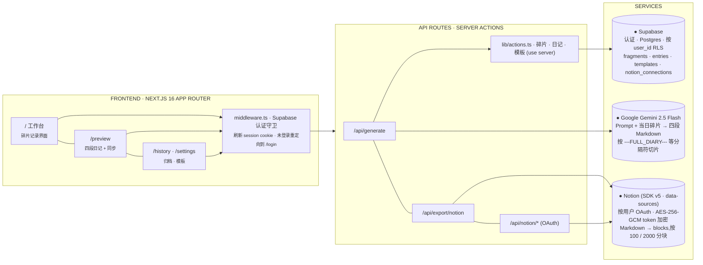

<div align="right">

[**中文**](./README.md)&nbsp;·&nbsp;[English](./README.en.md)

</div>

<div align="center">

<br>

<sub>· 你的 AI 外接大脑 ·</sub>

# Diarybuddy<span>.</span>

白天把任何想法随手丢进来 —— 一句念头、一段课堂笔记、一条通勤路上的短句。
晚上一键由 Gemini 沉淀成四段式日记，再一键同步进你自己的 Notion 工作区。

<br>

[](https://diarybuddy.vercel.app)
[](https://nextjs.org)
[](https://react.dev)
[](https://tailwindcss.com)
[](https://ai.google.dev)
[](https://vercel.com)
[](#协议)

</div>

<br>

---

大部分日记 App 的默认姿势是「坐下来，好好写」—— 这恰恰是最难的那一步。Diarybuddy 把循环反过来：白天往聊天式界面里扔碎片，晚上由 Gemini 把它们重组成 **一篇完整日记、关键要点、人生导师反思、和一张待办清单**，存进 Supabase，可以导出为 Markdown，也可以一键推送到你自己的 Notion 数据库。

> 「你的 AI 外接大脑 —— 随想随记，让模型帮你沉淀。」
> &nbsp;&nbsp;&nbsp;&nbsp;— Diarybuddy，产品北极星

<table>
<tr>
<td align="center"><b>4</b><br><sub>段式结构</sub></td>
<td align="center"><b>一键</b><br><sub>同步 NOTION</sub></td>
<td align="center"><b>按用户</b><br><sub>OAUTH + RLS</sub></td>
<td align="center"><b>.md</b><br><sub>批量导出</sub></td>
</tr>
</table>

---

## § 目录

<table>
<tr>
<td><code>01</code> <a href="#01-核心功能">核心功能</a></td>
<td><code>06</code> <a href="#06-快速开始">快速开始</a></td>
</tr>
<tr>
<td><code>02</code> <a href="#02-使用流程">使用流程</a></td>
<td><code>07</code> <a href="#07-项目结构">项目结构</a></td>
</tr>
<tr>
<td><code>03</code> <a href="#03-四段式输出">四段式输出</a></td>
<td><code>08</code> <a href="#08-配置说明">配置说明</a></td>
</tr>
<tr>
<td><code>04</code> <a href="#04-技术栈">技术栈</a></td>
<td><code>09</code> <a href="#09-路线图">路线图</a></td>
</tr>
<tr>
<td><code>05</code> <a href="#05-架构图">架构图</a></td>
<td><code>10</code> <a href="#10-常见问题与致谢">常见问题与致谢</a></td>
</tr>
</table>

---

## 01 核心功能

所有设计都围绕一个闭环：`记录 → 生成 → 同步`。

| | | |
|---|---|---|
| **✎ 碎片记录** <br><sub>`F.01`</sub> | **✦ 一键生成** <br><sub>`F.02`</sub> | **§ 四段式输出** <br><sub>`F.03`</sub> |
| 聊天式工作台，每条内容都打时间戳、直接写入 Supabase。会话日期锁在 `sessionStorage` 里，跨过午夜也不会悄悄翻页。 | 「生成」把当天碎片连同你编辑的 System Prompt 一起发给 `gemini-2.5-flash`。结果按 `session_date` upsert，重新生成就是覆盖。 | 完整日记 · 关键要点 · 人生导师洞察 · 待办清单。模型用固定分隔符输出四段，服务端解析后落进四个独立字段。 |
| **N Notion 同步** <br><sub>`F.04`</sub> | **▤ 历史与收藏** <br><sub>`F.05`</sub> | **⌘ Prompt 模板** <br><sub>`F.06`</sub> |
| 按用户 OAuth（Notion SDK v5，data-sources 模型）。access token 用 AES-256-GCM 加密落库，在设置里选好目标 Database，之后每篇日记一键同步。 | 按日历方式浏览所有日记。可以给条目加星标、回到过去那天重新看碎片、用更新后的 Prompt 再生成。 | 在「偏好设置」里直接编辑 System Prompt。每次生成注入的是最早的那一条模板 —— 改一改，就能换掉日记的「声音」，不用动代码。 |
| **↓ 批量 Markdown 导出** <br><sub>`F.07`</sub> | **⏻ 默认隐私** <br><sub>`F.08`</sub> | |
| 设置页一键下载所有日记为单个 `.md`（四段齐全、分隔清晰），适合冷备份，或丢进 Obsidian 自己接管。 | 每张表 RLS 按用户隔离；Notion token 入库前 AES-GCM 加密；OAuth `state` 用 HMAC 签名、10 分钟有效。密钥轮换等于作废所有已保存 token。 | |

---

## 02 使用流程

1. **打开工作台** —— 根据本地时间生成会话日期，并锁在 `sessionStorage`，一个标签页的生命周期内不再变。
2. **白天丢碎片**。每一条都走 `addFragment` server action，写入 `diary_fragments`，按你的 `user_id` 隔离。
3. **点「生成」**。`POST /api/generate {date}` 再校验一次登录态，把碎片拉出来、叠上你最早那条模板的 Prompt，调用 Gemini。
4. **响应按四个字面分隔符切片**（`---FULL_DIARY---` / `---KEY_POINTS---` / `---MENTOR_INSIGHTS---` / `---ACTION_ITEMS---`），upsert 到 `diary_entries`。
5. **在 `/preview` 审阅** —— 四段渲染成 Markdown，右边有「同步到 Notion」按钮。
6. **导出** —— 设置页批量下载 `.md`，或单篇推送到 Notion（`POST /api/export/notion`）。

---

## 03 四段式输出

Prompt 明确要求 Gemini 输出四段，之间用字面分隔符隔开。`/api/generate/route.ts` 里的 `parseResponse` 基于这些分隔符切片并落库 —— 改 Prompt 里的标题或分隔符格式时，记得同步改解析逻辑，否则会静默丢标题 / 丢段落。

| 板块 | 标题 | 落库字段 |
|---|---|---|
| `I.` | **📝 完整日记** <br><sub># 一级标题，含日期 + 主题</sub> | `diary_entries.full_diary` —— 标题被提取进 `title` |
| `II.` | **✨ 关键要点总结** <br><sub>5–7 条一句话要点</sub> | `diary_entries.key_points` |
| `III.` | **🧠 人生导师洞察** <br><sub>2–3 条洞察 + 2–3 条建议</sub> | `diary_entries.mentor_insights` |
| `IV.` | **✅ 待办事项** <br><sub>第一人称 Checkbox，按领域分组</sub> | `diary_entries.action_items` |

> **产品声音** &nbsp;·&nbsp; 默认 System Prompt 和种子模板都是中文写的；生成出来的是带 emoji 标题的中文 Markdown 日记。这是产品本身的「声音」，不要轻易翻译成英文 —— 用户可以自己改模板，管线并不在意语言。

---

## 04 技术栈

| 层级 | 选型 | 理由 |
|---|---|---|
| 框架 | `Next.js 16`（App Router） | Server Actions + API Routes 一体，Vercel 原生。 |
| 运行时 | `React 19` + `TypeScript 5` | Server Components、工作台的异步 Suspense 边界。 |
| UI | `Tailwind v4` + `lucide-react` | 手写的暖纸色系作为 utility class，不被任何设计系统绑死。 |
| 认证 & 数据库 | `Supabase`（Postgres + Auth） | 每张表开启 RLS；`user_id` 默认 `auth.uid()`。 |
| 大模型 | `@google/generative-ai` · gemini-2.5-flash | 快、便宜、上下文足够 —— 一整天的碎片一次塞完。 |
| Notion | `@notionhq/client` v5 | Data-sources 模型（非旧版 `database_id`）。token AES-256-GCM 加密。 |
| 加密 | Node `crypto` | Notion token 走 AES-GCM；OAuth `state` HMAC 签名、10 分钟有效；共用一把 `NOTION_TOKEN_ENCRYPTION_KEY`。 |
| 部署 | `Vercel`（自动） | 推到 `main` → 约 90 秒内上线。环境变量放在 Project Settings。 |

---

## 05 架构图



---

## 06 快速开始

> **工作流** &nbsp;·&nbsp; 本项目**云优先**。日常改动：编辑 → 推到 `main` → Vercel 大约 90 秒内自动部署到 [diarybuddy.vercel.app](https://diarybuddy.vercel.app)。环境变量在 Vercel Project Settings 里配。本地 `npm run dev` 只用于离线调试。

### 环境要求

- Node `>= 20`，使用原生 `npm`（没有其他包管理器的约定）
- 一个 Supabase 项目，执行过 `supabase-schema.sql`
- 一个 Gemini API Key
- （可选）一个 Notion *Public* 集成，并注册好 redirect URI

### 本地起项目

```bash
# 克隆
git clone https://github.com/turtojian520/diarybuddy.git
cd diarybuddy   # package.json 就在根目录

# 安装依赖
npm install

# 环境变量 —— 指向非生产的 Supabase/Notion，别污染线上
cp .env.local.example .env.local
# 填入 SUPABASE_URL / ANON_KEY / GEMINI_API_KEY / NOTION_*

# 在 Supabase SQL Editor 里执行:
#   supabase-schema.sql

npm run dev    # → http://localhost:3000
npm run build  # 类型 + lint 检查（项目没有测试框架）
```

---

## 07 项目结构

```text
diarybuddy/                       # 仓库根 —— package.json 就在这
├── src/
│   ├── middleware.ts             # Supabase 认证守卫（未登录跳 /login）
│   ├── app/
│   │   ├── page.tsx              # 工作台 —— 碎片记录 + 生成
│   │   ├── preview/page.tsx      # 四段式日记 + 同步 Notion
│   │   ├── history/page.tsx      # 历史归档 / 收藏
│   │   ├── settings/page.tsx     # Prompt 模板 + Notion 连接 + 批量导出
│   │   ├── login/ · auth/callback/   # Supabase Auth
│   │   └── api/
│   │       ├── generate/         # POST —— 调 Gemini，按分隔符解析，upsert
│   │       ├── export/notion/    # POST {date} —— 构建 blocks，创建 Notion 页
│   │       └── notion/           # oauth · databases · select-database · status · disconnect
│   ├── components/
│   │   └── TopNav.tsx
│   └── lib/
│       ├── actions.ts            # 'use server' —— CRUD + DEFAULT_TEMPLATES
│       ├── crypto.ts             # AES-256-GCM + HMAC 签名的 OAuth state
│       ├── utils.ts              # getTodayDate / formatDateDisplay
│       ├── supabase.ts           # 浏览器 client + 行类型定义
│       ├── supabase/             # browser · server · middleware 三种 client
│       └── notion/               # client · markdown-to-blocks
├── supabase-schema.sql           # schema 变更时去 SQL Editor 执行
├── CLAUDE.md / AGENTS.md         # 贡献者须知
└── .env.local.example
```

---

## 08 配置说明

### 环境变量

<sub>生产环境写在 Vercel Project Settings 里。`.env*` 文件都在 `.gitignore`。</sub>

| Key | 必填 | 用途 |
|---|---|---|
| `NEXT_PUBLIC_SUPABASE_URL` | 是 | Supabase 项目地址。 |
| `NEXT_PUBLIC_SUPABASE_ANON_KEY` | 是 | 公开 anon key —— 所有表都开了 RLS。 |
| `GEMINI_API_KEY` | 是 | `gemini-2.5-flash` 的密钥。 |
| `NOTION_OAUTH_CLIENT_ID` | 是 | Notion Public 集成的 Client ID。 |
| `NOTION_OAUTH_CLIENT_SECRET` | 是 | Notion Public 集成的 Client Secret。 |
| `NOTION_OAUTH_REDIRECT_URI` | 是 | 必须和 Notion 集成里登记的 redirect 完全一致。 |
| `NOTION_TOKEN_ENCRYPTION_KEY` | 是 | 32 字节 base64。**同时**用作 token 的 AES-GCM 密钥和 OAuth `state` 的 HMAC 密钥。轮换它 = 作废全部已保存 token。 |

```bash
# 生成加密密钥
node -e "console.log(require('crypto').randomBytes(32).toString('base64'))"
```

### 数据库 Schema

所有表都有 `user_id uuid` → `auth.users(id)`，启用 RLS，策略约束 `auth.uid() = user_id`，并且 `user_id` 默认 `auth.uid()`。

| 表 | 字段 |
|---|---|
| `diary_fragments` | `id · content · created_at · session_date`（YYYY-MM-DD） |
| `diary_entries` | `id · session_date · title · full_diary · key_points · mentor_insights · action_items · generated_at · is_highlighted` —— *`(user_id, session_date)` 唯一，upsert 目标* |
| `diary_templates` | `id · name · description · prompt` —— 每次生成注入的是最早的那一条 |
| `notion_connections` | 每个用户一条，存加密 token / `data_source_id` / `data_source_title` / `title_prop_name` / `date_prop_name` |

---

## 09 路线图

### Phase 1 · 核心闭环 &nbsp;`已交付`

- [x] 碎片记录 + 会话日期锁
- [x] Gemini 2.5 Flash 生成 · 按分隔符切出四段
- [x] Supabase 认证（邮箱 + OAuth），每张表 RLS
- [x] 设置页批量 `.md` 导出

### Phase 2 · Notion 同步 &nbsp;`已交付`

- [x] 按用户 OAuth（Notion SDK v5，data-sources）
- [x] AES-256-GCM 加密 token，HMAC 签名 OAuth state（10 分钟有效）
- [x] Markdown → Notion blocks（按 100 个子节点 / 2000 字分块）
- [x] 设置页选 Database，`/preview` 一键同步

### Phase 3 · 多模态 & 深化 &nbsp;`进行中`

- [ ] Whisper 语音输入（UI 里麦克风按钮目前是占位）
- [ ] 文件 / 图片碎片（回形针按钮目前是占位）
- [ ] 生成时可选模板（当前只用第一条）
- [ ] Obsidian / Bear 导出对齐

### Phase 4 · 反思 &nbsp;`计划中`

- [ ] 跨周 / 跨月的情绪与主题趋势
- [ ] 「问你的日记」—— 对个人历史做 RAG
- [ ] PWA + 移动端 Share Target

---

## 10 常见问题与致谢

### 我的日记隐私吗？

放心。每张表都按 `auth.uid()` 开启行级安全。Notion access token 入库前用 AES-256-GCM 加密；OAuth `state` 用 HMAC 签名、10 分钟有效。你可以在设置页批量导出并删除所有内容。

### 为什么用字面分隔符，不用 JSON？

Gemini 2.5 Flash 输出带分隔符的 Markdown 很稳定，而产品本来就需要 Markdown —— 前端渲染器和 Notion 的 blocks 转换器都直接吃 Markdown。用 JSON 相当于把日记再编码一层，还会丢失 GFM 的保真度。

### 为什么默认是中文？

这个项目最早从一段中文的 Gemini 日记工作流里长出来，四段式结构是在约 90 天的真实使用中收敛出来的。默认 Prompt 和种子模板都是中文，输出是带 emoji 标题的中文 Markdown。模板可以改成任何语言 —— 管线并不在意。

### 为什么没有测试框架？

`npm run build` 兼做类型 + lint；其他都靠 Vercel 预览地址人工验证。想加 Vitest / Playwright，请先开一个 Issue 讨论。

### 致谢

- 最初的手动 Gemini 日记工作流，四段式结构就是从那里长出来的
- Supabase 的 SSR 认证 + RLS 基础能力
- Notion SDK v5 团队提供的 data-sources API
- alpha 期间所有提过 [Issue](https://github.com/turtojian520/diarybuddy/issues) 的朋友

### 协议

MIT。

---

<div align="center">
<sub>MIT · © 2026 diarybuddy contributors</sub><br>
<sub><a href="#diarybuddy">↑ 回到顶部</a> &nbsp;·&nbsp; <a href="./README.en.md">EN</a></sub>
</div>
